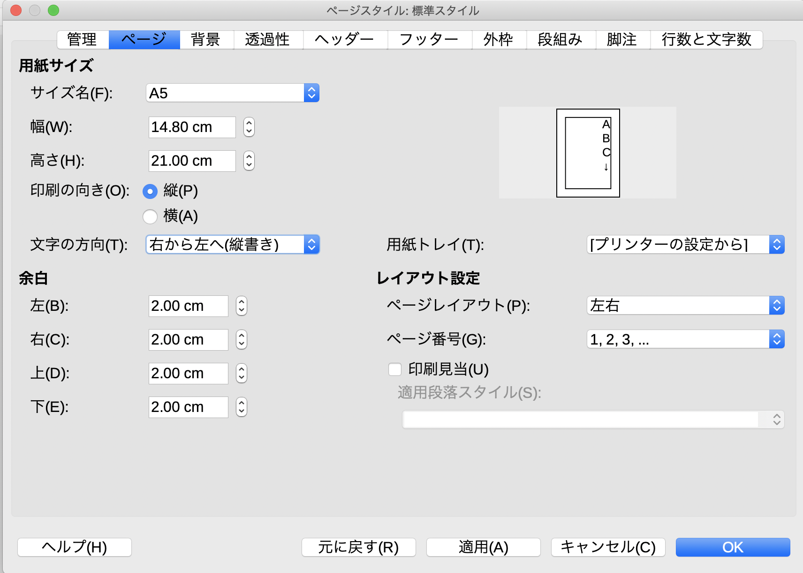
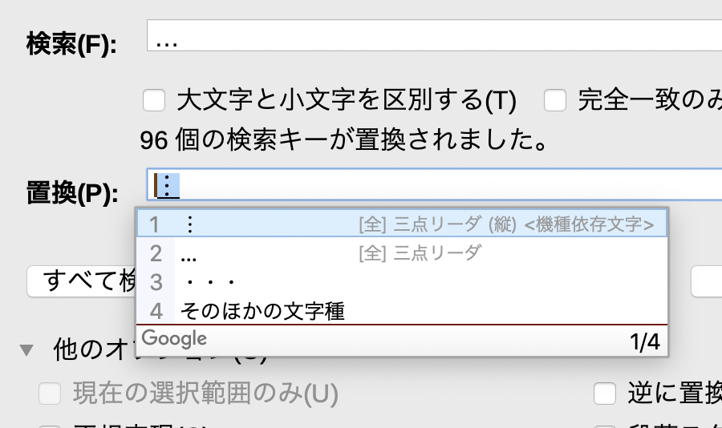
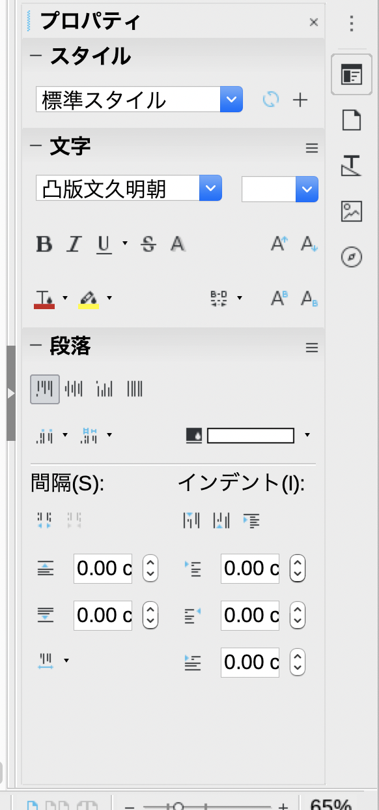
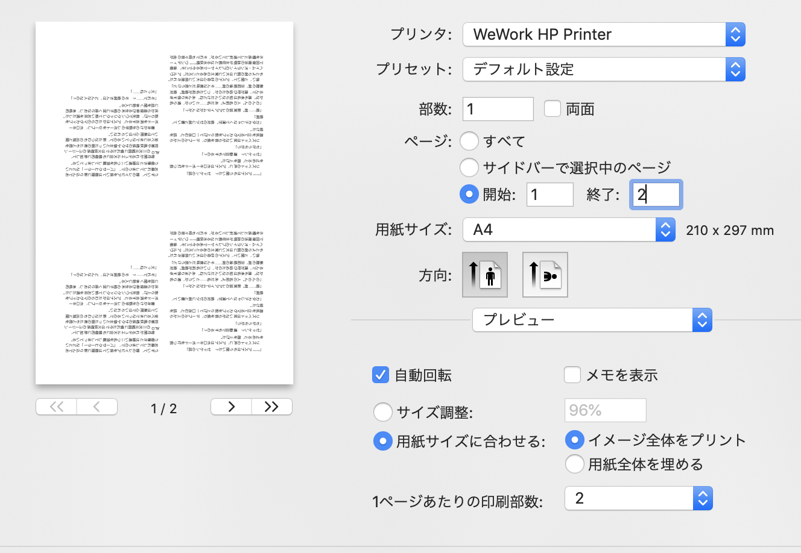

## 無料で段組み小説PDFを作る方法

開発終了してしまったOpenOfficeの代わりにLibreOfficeを利用します。

- https://www.libreoffice.org/download/download/?type=win-x86_64&version=6.3.1&lang=ja

### 1. 新規作成する

「ファイル -> 新規作成 -> 文書ドキュメント」で新規作成します。

手元にあるテキストファイルをコピペします。

### 2. 縦書きにする

「書式 -> ページ」でページ設定ダイアログを開き、ページタブを選択します。

- 用紙サイズ: A5
- 文字の方向: 右から左へ（縦書き）

を選んでOKで縦書きになります。

### 3. 2段組みにする

余白をさらに減らすために2段組みにします。

「書式 -> 段組み」で段組みダイアログを開きます。

- 列: 2
- 幅と間隔 -> 間隔: 0.8cm

を入力してOKで2段組みになります。

### 4. 3点リーダーの位置ずれ

発生しないかもしれませんが、3点リーダーの位置がずれてしまう場合は「…」3点リーダーを「︙」垂直3点リーダーに変換する必要があります。

「編集 -> 検索と置換」で置換ダイアログを表示します。

- 検索: …
- 置換: ︙

### 5. 行間などを調節する

「書式 -> 段落の書式」で段落ダイアログを表示します。「インデントと行間隔」で行間を指定出来ます。

比率指定 95%くらいが好きなのですが、テキストが多いと重なってしまう場合があります。

その時は画面右端のプロパティのプロパティダイアログで間隔を広げる、狭めるを繰り返すと直ります。

### 6. PDFを作成して保存

「ファイル -> 次の形式でエクスポート -> PDFとしてエクスポート」でPDFにエクスポートできます。

### 7. 印刷ダイアログで複数枚指定する

A4であれば2枚、A3であれば4枚割付印刷ができます。

